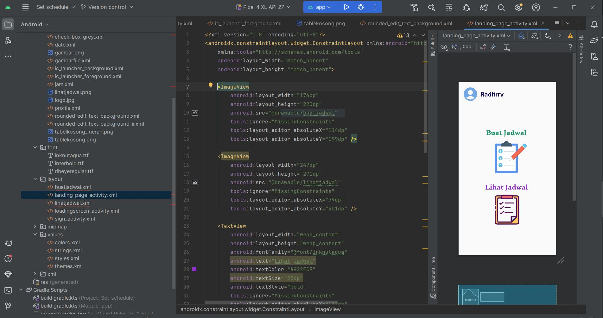

# Project UTS { Semester 3 } 

## Profil
|  |  |
| -------- | --- |
| **Nama** | Raditra Ikhwanul Arifin |
| **Kelas** | TI.23.A5 |
| **Mata Kuliah** | Pemrograman Mobile 1 |

# Set Schedule App

**Set Schedule** adalah sebuah aplikasi berbasis Android yang dirancang untuk membantu pengguna mengatur dan mengelola jadwal mereka. aplikasi ini memungkinkan pengguna untuk membuat, menyimpan, dan melihat jadwal harian atau acara tertentu dengan tampilan yang sederhana dan intuitif. Aplikasi ini dirancang untuk memberikan pengalaman pengguna yang mudah digunakan, membantu meningkatkan produktivitas, dan memastikan pengguna tidak melewatkan aktivitas penting.

## Output

***Keterangan :***

- Berikut adalah tampilan awal apabila ``telah berhasil di RUN`` di awali dengan judul aplikasi **Set Schedule**.

## Output

***Keterangan :***

- Setelah menunggu beberapa detik, ``maka akan pergi menuju menu sign in untuk memasukkan nama pengguna``

## Output 

***Keterangan :***

- Selanjutnya, bisa langsung ``klik tombol MASUK``. Maka, tampilannya akan berubah untuk masuk ke Halaman utama.

## Output

***Keterangan :***

- Selanjutnya, Untuk membuat jadwal ``klik tombol buat jadwal``. Maka, tampilannya akan berubah untuk masuk ke detail pembuatan jadwal.

## Output

***Keterangan :***

- Selanjutnya, setelah membuat jadwal kita bisa melihat jadwal yang sudah kita buat ``dengan mengklik tombol Lihat Jadwal`` maka kita akan bisa melihat jadwal apa saja yang telah kita buat, klik tombol kembali untuk menuju kembali ke halaman utama

## SELESAI  